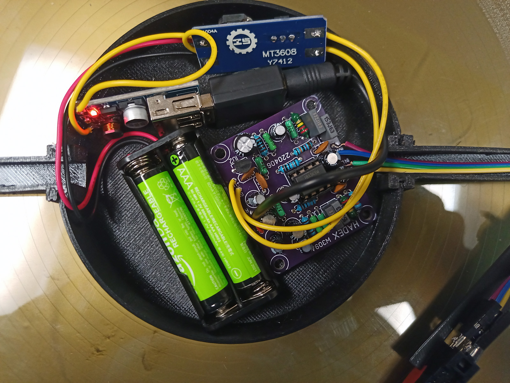

# Gramofon
Vytváříme gramofon pro výzvu: [Přehraj desku](https://www.elixirdoskol.cz/l/prehraj-desku/)

## Celkový popis

Foto [zde](https://owncloud.cesnet.cz/index.php/s/BCm2MCylGpjqCPX).

U tohoto gramofonu se nebude točit deska, ale rameno s přenoskou. Toto rameno bude mít motor umístěný pod deskou, výstup motoru projde středem desky .

V krabičce je:
 - motor 
 - baterie
 - potenciometr
 - zesilovač

## Naše teamy:
(kdo co dělal)

### -> [motor](motor.md) :
 - [Maty](https://github.com/matyasvanke)
 - [Vítek](https://github.com/vextr2009)

### -> [zesilovač](zesilovac.md) :
 - [David](https://github.com/davsla12)
 - Kuba 
 - Kuba

### -> [přenoska](prenoska.md) :
 - [Fabián](https://github.com/BabaFabaBaba)
 - Tobiáš

desing [README.md](README.md) by: [davsla12](https://github.com/davsla12)
