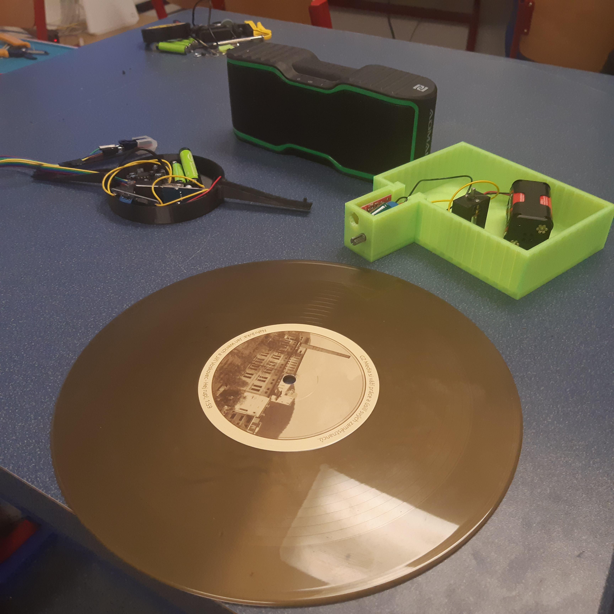

# Gramofon
Info o nás: [https://github.com/robodilna/info/](https://github.com/robodilna/info/).

Vytváříme gramofon pro výzvu: [Přehraj desku](https://www.elixirdoskol.cz/l/prehraj-desku/)

Soutěžní fotky a videa naleznete [zde](https://owncloud.cesnet.cz/index.php/s/eIMceqzjqqCfIv8). Všechny pak [tady](https://owncloud.cesnet.cz/index.php/s/mdDDFQjWMxmmJgJ)

## Celkový popis

U tohoto gramofonu se nebude točit deska, ale rameno s přenoskou. Toto rameno bude mít motor umístěný pod deskou, výstup motoru projde středem desky.
- 3D modely [zde](models) ve formátu .stl i .scad.

Protože je nás 9, rozdělili jsme se do 3 [týmů](#naše-teamy) - každý se věnoval části gramofonu. Dokumentace k jednotlivým dílům je na stránkách jednotlivých týmů: 
 - [motor](motor.md)
 - [zesilovač](zesilovac.md)
 - [přenoska](prenoska.md)
 
 Naše úvodní Brainstormování je na samostatné [stránce](Brainstorming.md).

Naši mentoři sepisovali [průběh stavby](zapisky.md).

## Naše teamy
(kdo co dělal)

### -> [motor](motor.md) :
 - [Maty](https://github.com/matyasvanke)
 - [Vítek](https://github.com/vextr2009)
 - Dan

### -> [zesilovač](zesilovac.md) :
 - [David](https://github.com/davsla12)
 - Kuba N. 
 - Kuba B.
 - Ondra
 - Honza

### -> [přenoska](prenoska.md) :
 - [Fabián](https://github.com/BabaFabaBaba)

desing [README.md](README.md) by: [davsla12](https://github.com/davsla12)
