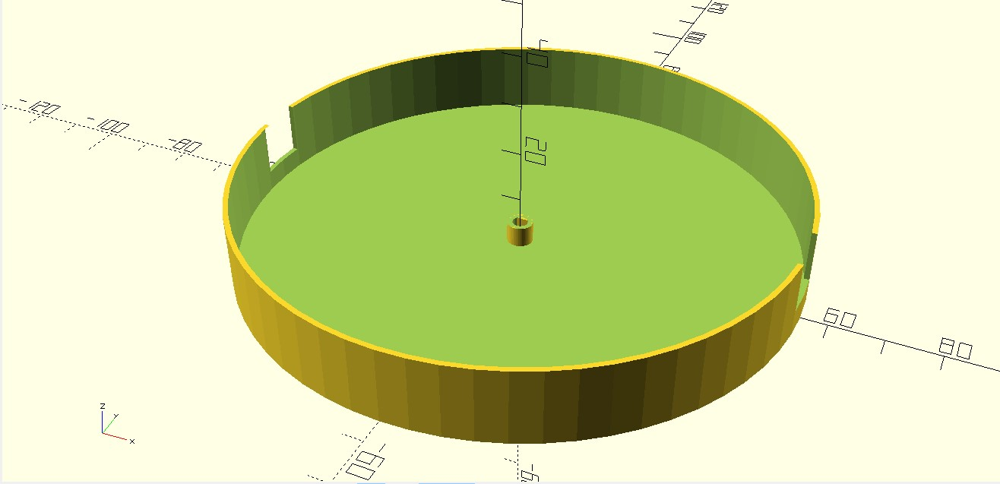

[<-zpět](https://github.com/robodilna/gramofon/tree/main/models)

Zde jsou všechny náhledy modelů.
- STL modely jsou [zde](https://github.com/robodilna/gramofon/tree/main/models/stl-models).
- SCAD modely jsou [zde](https://github.com/robodilna/gramofon/tree/main/models/scad-models)

## ready to print

## Krabička předzesilovače

## Rameno přenosky

## Rameno hlavní

## Úchyt motoru

