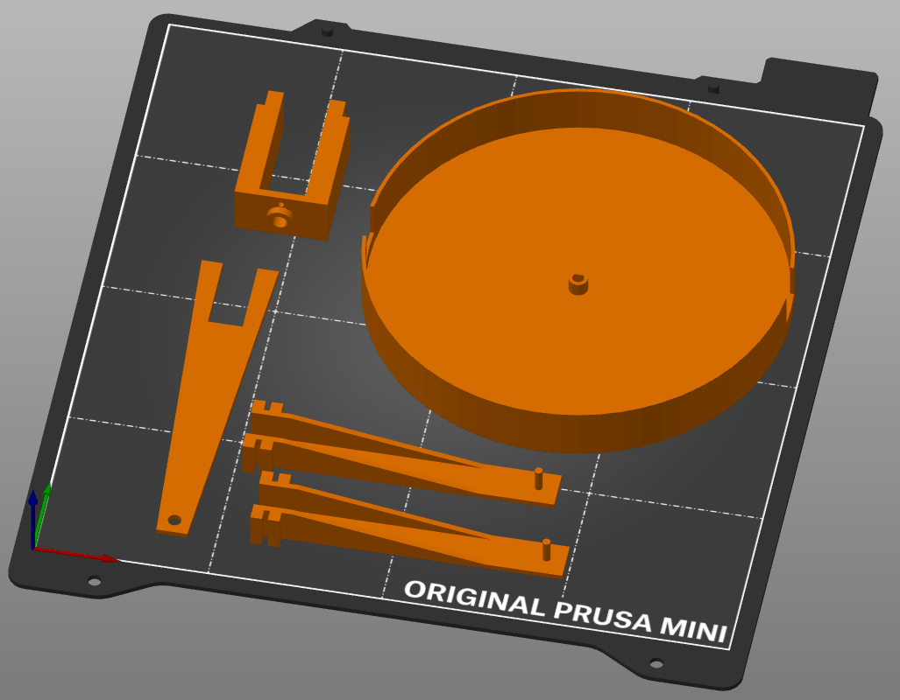

[<-zpět](https://github.com/robodilna/gramofon#readme)
# Popis 3D dílů

Všechny 3D díly jsou designované v OpenSCADu. V dalších složkách jsou modely ve formátu .STL a náhledy modelů.

## Jak na to?

Každý díl je třeba vytisknout jednou, kromě dílu rameno.scad - ten je potřeba 2x.

## Náhled

Všechny díly kromě spodní krabičky:

