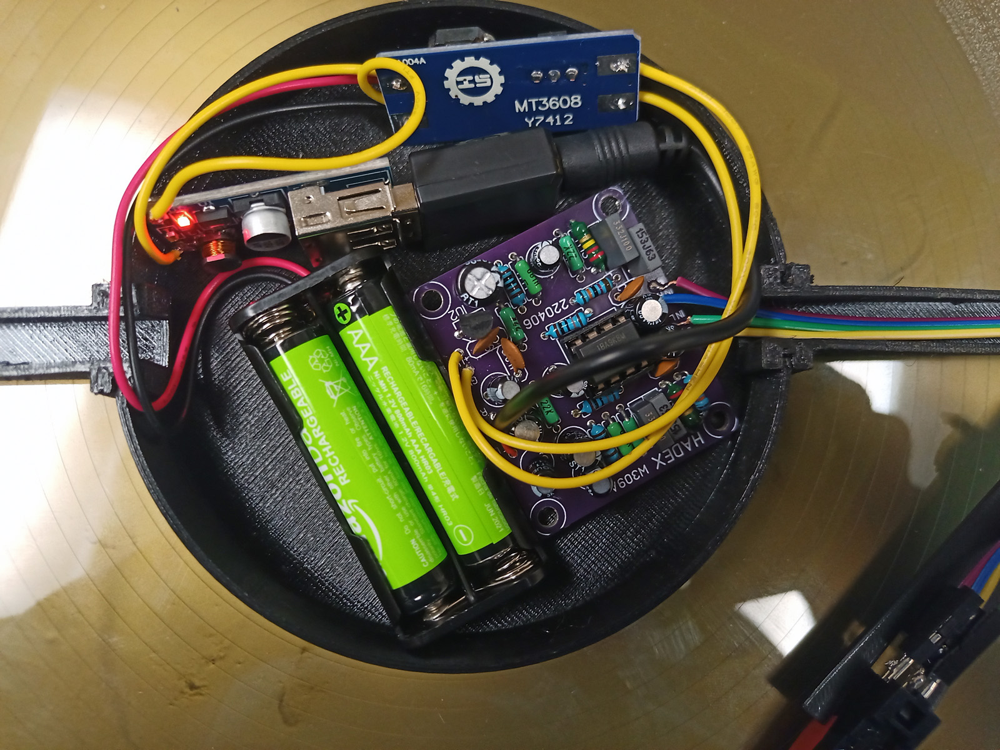

[<-zpět](https://github.com/robodilna/gramofon)

# Team [zesilovač](zesilovac.md)

## Členové:
 - [David](https://github.com/davsla12)
 - Kuba 
 - Kuba

## Součástky: 
1. https://www.laskakit.cz/comf-bh-421a-drzak-baterie-2xaaa-dratove-vyvody/
2. https://www.laskakit.cz/mini-step-up-boost-menic-s-usb/
3. https://www.laskakit.cz/step-up-boost-menic-s-mt3608/
4. https://www.laskakit.cz/bluetooth-stereo-audio-modul-kn320/
5. https://www.hadex.cz/w309a-predzesilovac-pro-magnetodynamickou-prenosku-stereo-v2-stavebnice/?gclid=Cj0KCQiAtvSdBhD0ARIsAPf8oNnTNTesRO7UDsawQV9PurzXJc69FB86xegFsnCnZljKdQSnjBYm0BIaAiZbEALw_wcB

## Jak to funguje:

Předzesilovač zesílí signál z přenosky a pošle ho do bluetooth adaptéru. Vše napájí dvě AAA baterky, je třeba boostnout napětí na 5V pro BT transmitter a 12V pro předzesilovač.

## Design:
prostě elektrika...

